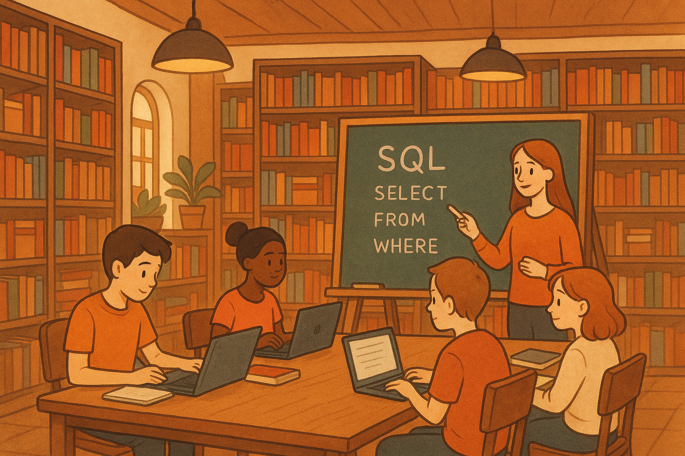

# 
 Cours complet SQL 

    

[Read in English](README.md)

# 🎯 Objectifs du dépôt
Ce dépôt a pour vocation de rassembler l’ensemble de mon travail en SQL, à la fois comme :

* 🧠 preuve de maîtrise du langage,

* 📚 base pédagogique ouverte et adaptable à tout niveau,

* 🔍 terrain d’exploration approfondi du langage SQL.

L’ambition est de proposer une approche complète et évolutive : du simple SELECT à des sujets plus avancés comme la modélisation relationnelle, les vues, les sous-requêtes, les CTEs, ou encore les jointures complexes.

# 👨‍🏫 Un contenu pensé pour l’apprentissage
Une partie de ces ressources est déjà utilisée dans un cadre d’enseignement à des étudiants de BTS.
Le contenu est donc :

* Ludique et progressif, notamment les TP orientés "énigmes" ou "enquêtes" (ex. SQL Murder Mystery),

* Structuré en modules, facilement réutilisables dans un cadre pédagogique,

* Adapté à tous niveaux : débutants, curieux, autodidactes ou futurs data analysts.

# Sources

Voici tous les liens qui m'ont permis de monter ce dépôt github. 

Pour le cours et les TP :
- https://www.coursera.org/learn/sql-data-science?specialization=ibm-data-science
- https://dquenton.forge.apps.education.fr/nsi-terminale-specialite/BaseDeDonnees/BaseDeDonnees00/
- https://www.lyceum.fr/tg/nsi/2-bases-de-donnees/
- https://github.com/kansiris/SQL-interview-questions/tree/master
- https://leetcode.com/studyplan/top-sql-50/

Pour le TP numéro 2 : 
- https://mystery.knightlab.com/
- https://www.kaggle.com/datasets/johnp47/sql-murder-mystery-database/
- https://qkzk.xyz/docs/nsi/cours_terminale/bdd/murder_mystery/

Pour le TP numéro 3 : 

- https://dquenton.forge.apps.education.fr/nsi-terminale-specialite/BaseDeDonnees/Ghibli_SQL/

Python et le SQL : 
- https://www.easypythondocs.com/SQL.html
- https://docs.python.org/3/library/sqlite3.html

Plan d'apprentissage 30 jours :
- https://www.linkedin.com/posts/gael-penessot_dataanalytics-sql-activity-7243861676297449472-by1f?utm_source=share&utm_medium=member_desktop

L'ensemble des illustrations a été réalisé avec ChatGPT-4.
