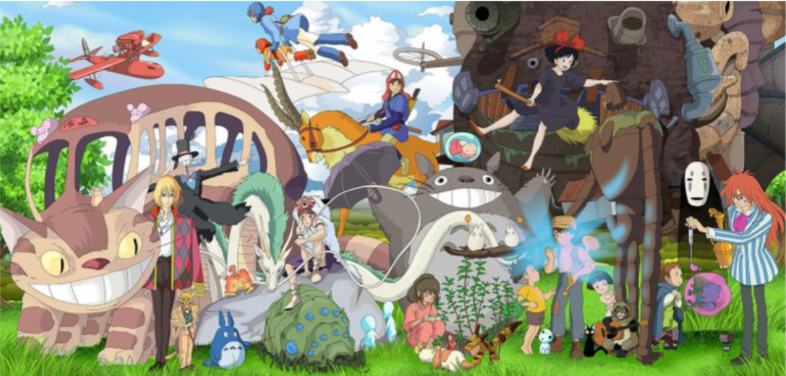

# TP SQL sur les films du Studio Ghilbi

    

## Objectifs :
- Visualiser et travailler avec plusieurs tables d'une base de données SQL
- Apprendre à écrire des lignes de commande SQL
- Extraire des informations d'une base de données SQL
- Développer un esprit critique sur les résultats obtenus
- Réaliser l'importance des types d'une colonne
- Maîtriser les commandes JOIN

## Questions du TP 

1. Lister toutes les informations concernant tous les films de la BDD.

2. Comme les informations sont trop nombreuses, et que tout ne nous intéresse pas, on se contentera de la liste des titres et de leur année de réalisation seulement.

3. Déterminer la table nécessaire et faire apparaître le nom de tous les personnages ainsi que leur âge.

4. Recommencer la même sélection, mais en faisant un tri croissant sur l'âge des personnages.

    - Vérifier que le personnage le plus jeune avec un âge connu est «Mei Kusakabe».
    - Quelle remarque peut-on faire ? 
    - Comment expliquer ce résultat ? Comment aurait-on pu éviter le problème ?

5. Afficher maintenant les titres des 5 films les plus courts ainsi que leur durée.

6. Afficher l'URL de l'affiche du film (movie_banner) «Castle in the Sky». Visualiser le résultat dans un nouvel onglet.

7. Compter le nombre de personnages dans la BDD.

8. Afficher la liste des films réalisés entre les années 1995 et 2005 exclues.

9. Afficher les films réalisés par «Hayao Miyazaki»

10. Afficher les films réalisés par la famille «Miyazaki»

11. Compter le nombre de films réalisés par «Isao Takahata»

12. Afficher les films dont le réalisateur est aussi le producteur.

13. Afficher les films produits par «Hayao Miyazaki»

14. Afficher les personnages du film «My Neighbor Totoro»

15. Dans quels films apparaît le personnage du «Baron Humbert von Gikkingen»

16. Donner la liste de tous les personnages non "Human" et leur type.

17. Donner la liste de tous les personnages non humains du film «My Neighbor Totoro», ainsi que leur espèce.