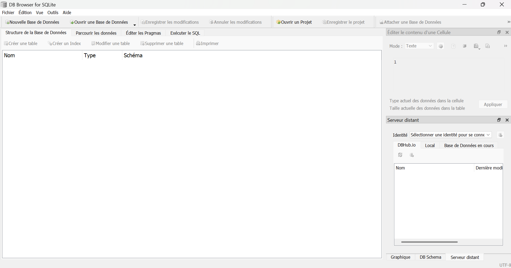
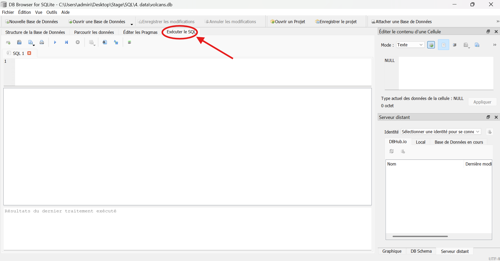

# Tutoriel pour utiliser DB Browser (SQLite)

## 📦 Installation du logiciel

On commence par télécharger le logiciel DB Browser(SQLite) via ce lien : https://sqlitebrowser.org/dl/

**Note** : Installateurs disponibles pour :

* Windows (`.exe` ou `.zip`)
* macOS (via dmg ou Homebrew : `brew install --cask db-browser-for-sqlite`)
* Linux (via `apt`, `dnf`, `snap`, etc.)

Une fois l'installation réalisée, on doit normalement avoir cette icône sur le bureau :

  

## 🧰 Présentation du logiciel 

DB Browser for SQLite (anciennement "SQLite Database Browser") est une application gratuite, open source et multiplateforme (Windows, macOS, Linux) qui permet de créer, visualiser et éditer facilement des bases de données SQLite via une interface graphique.

Il est particulièrement adapté pour :

* les développeurs qui veulent inspecter leurs fichiers .sqlite ou .db localement

* les étudiants ou enseignants qui apprennent SQL sans avoir besoin d’installer un serveur

* les projets légers, comme des apps mobiles ou embarquées utilisant SQLite

## 🧮 Utilisation du logiciel

Une fois le logiciel lancé, voici à quoi ressemble l'interface :

  

### 📂 Ouvrir/Visualiser une base de données

Dans `Fichier`, on va cliquer sur `Ouvrir un Base de Données…` et on
sélectionne la base de données sur laquelle on veut travailler ou qu'on veut visualiser. (Voir les étapes en images ci-dessous)

  

Puis :

  

Comme expliqué précédemment, il s'agit des fichiers en `.sqlite` ou `.db` :

  

On voit alors apparaître une table dans notre interface : 

  

Pour parcourir les lignes de notre base de données, il suffit de cliquer sur `Parcourir les données` :

  

### 🔑 Taper/Exécuter des commandes SQL

Pour taper des commandes SQL afin de travailler sur notre base de données, il faut aller dans l'onglet `Exécuter le SQL.` :

  

C'est dans cette partie qu'on tape nos commandes. Pour exécuter la commande tapée, il suffit de cliquer sur le bouton play ▶️ en vert :

  

On visualise directement le résultat dans la partie inférieur de la fenêtre.

### 📥 Sauvegarder vos vues (= vos résulats)

Une fonctionnalité très intéressante de ce logiciel est la possibilité d'exporter la vue en format `.csv`.

Voici comment faire : 

  

On peut également `Enregistrer comme une vue`.

Très pratique dans le cadre d'un TP ou d'un travail qui demandera d'éxécuter plusieurs commandes. 

On peut donc enregistrer nos vues, avec le nom que l'on veut, par exemple "question1" (donc le résultat de l'éxécution de nos différentes commandes) et retrouver le tout dans la section principale `Structure de la Base de Données` :

  

## 📘 Documentation 

Pour plus d'informations, se reporter à la documentation : https://github.com/sqlitebrowser/sqlitebrowser/wiki

